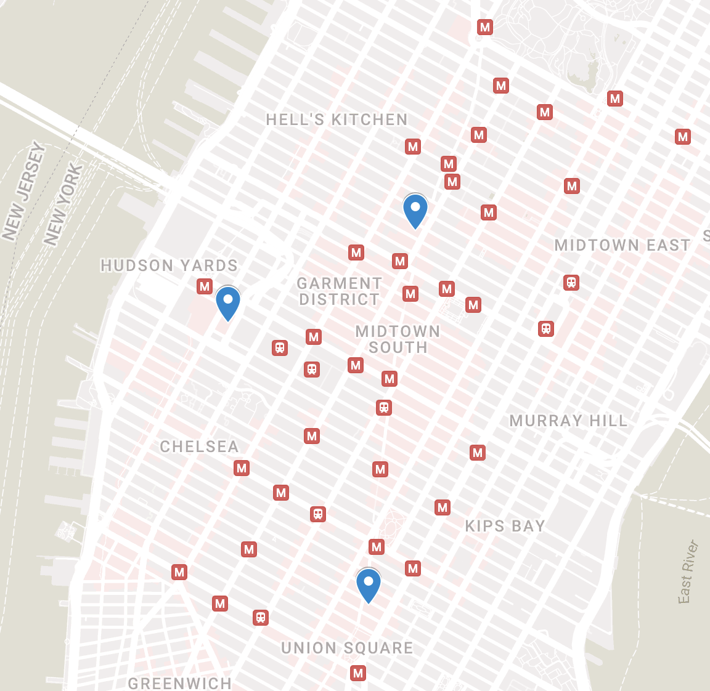

# sagaftrastrikemap

A [map](https://www.google.com/maps/d/edit?mid=1wyqQiFfwRoIQOT_bw_XfoXgp5nCEW-I&usp=sharing) of sagaftrastrike.org gatherings. Turns out there are only gatherings in NYC and LA...

To create it:

1. Creates `locs.csv` with
  
    yarn run csv

2. Follow [these instructions](https://colettebecker.medium.com/how-to-import-a-bunch-of-addresses-on-to-google-maps-all-at-once-ad8212b87f2d) to import the CSV into a map.

