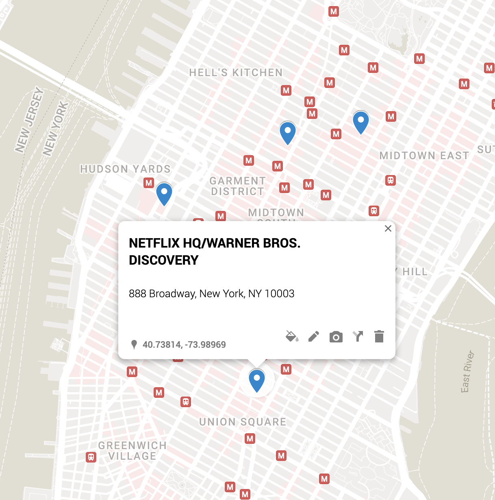

# sagaftrastrikemap

A [map](https://www.google.com/maps/d/edit?mid=1wyqQiFfwRoIQOT_bw_XfoXgp5nCEW-I&usp=sharing) of sagaftrastrike.org [picket locations](https://www.sagaftrastrike.org/picket-schedule-locations). Turns out there are only gatherings in [NYC](https://www.google.com/maps/d/edit?mid=1wyqQiFfwRoIQOT_bw_XfoXgp5nCEW-I&ll=40.745562463040436%2C-73.98301997102885&z=14) and [LA](https://www.google.com/maps/d/edit?mid=1wyqQiFfwRoIQOT_bw_XfoXgp5nCEW-I&ll=33.99587812188659%2C-118.27350501944001&z=11)...oh well.

To create it:

1. Creates `locs.csv` with
  
  ```bash
  yarn run csv
  ```

1. Follow [these instructions](https://colettebecker.medium.com/how-to-import-a-bunch-of-addresses-on-to-google-maps-all-at-once-ad8212b87f2d) to import the CSV into a map.


